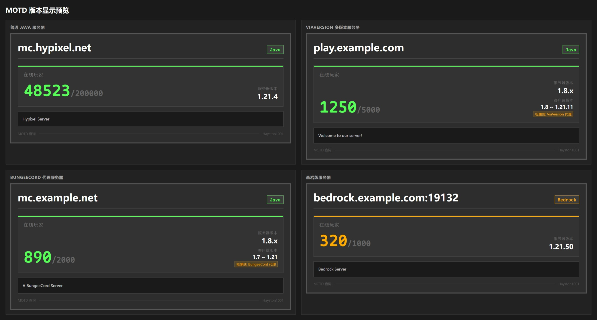

# AstrBot MOTD 查询插件

一个用于查询 Minecraft 服务器状态的 AstrBot 插件，支持 Java 版和基岩版服务器，**兼容 ViaVersion 多版本服务器**。



## 功能特性

- ✅ **MOTD 查询**: 查询 Minecraft 服务器的 MOTD、在线玩家、版本等信息
- ✅ **双版本支持**: 同时支持 Java 版和基岩版服务器查询
- ✅ **图片输出渲染**: 支持输出精美图片
- ✅ **ViaVersion 兼容**: 智能识别 ViaVersion 多版本服务器，正确显示版本范围
- ✅ **无需斜杠**: 直接输入 `motd` 即可触发，无需 `/` 前缀
- ✅ **默认服务器**: 可配置默认查询的服务器，简化指令使用
- ✅ **标准端口**: 查询其他服务器时不带端口自动使用标准端口 25565
- ✅ **API 查询**: 使用 mcstatus.io API 查询，更稳定可靠
- ✅ **会话控制**: 可设置对哪些群聊/私聊生效
- ✅ **管理员权限**: 插件配置仅管理员可修改
- ✅ **完善报错**: 详细的错误提示和帮助信息

## ViaVersion 兼容性

本插件支持安装了 ViaVersion/ViaBackwards 的服务器：

| 情况 | 处理方式 |
|------|----------|
| `protocol.version = -1/0` | 识别为多版本模式，显示 `多版本` 而非 `-1` |
| `version.name` 含版本范围 | 自动提取并显示 `支持客户端版本: 1.8 - 1.21.3` |
| Paper/Spigot + ViaVersion | 解析协议号范围并转换为版本号显示 |
| ViaVersion 字样检测 | 自动识别并标注 ViaVersion 兼容 |

## 使用方法

### 方法一: 在官方插件市场中搜索 "Minecraft 服务器 motd 查询"

### 方法二: 在本仓库下载插件 zip 文件, 在 WebUI 中选择从文件安装插件

⚠️**重启 AstrBot**（重要！热重载可能无法正确加载配置）

## 配置方法

### 1. 在 WebUI 中配置

| 配置项 | 说明 | 建议值 |
|--------|------|--------|
| `default_server` | 默认服务器地址 | `n.rainplay.cn` |
| `default_port` | 默认服务器端口 | `46861` |
| `enable_all_sessions` | 对所有会话生效 | ✅ 勾选 |
| `use_api` | 使用 API 查询 | ✅ 勾选（更稳定） |
| `query_timeout` | 查询超时时间 | `5` |

**配置完成后必须重启 AstrBot！**

### 2. 配置文件方式

也可以直接编辑 `data/config/astrbot_plugin_minecraft_motd_config.json`：

```json
{
    "default_server": "n.rainplay.cn",
    "default_port": 46861,
    "enable_all_sessions": true,
    "enabled_sessions": [],
    "admin_only_config": true,
    "query_timeout": 5,
    "use_api": true
}
```

## 使用方法

### 基础指令（无需斜杠）

| 指令 | 说明 | 示例 |
|------|------|------|
| `motd` | 查询默认服务器 | `motd` |
| `motd <地址>` | 查询指定服务器（使用标准端口 25565） | `motd mc.hypixel.net` |
| `motd <地址:端口>` | 查询指定服务器（使用指定端口） | `motd n.rainplay.cn:46861` |
| `motd-bedrock` | 查询默认基岩版服务器 | `motd-bedrock` |
| `motd-bedrock <地址:端口>` | 查询指定基岩版服务器 | `motd-bedrock mc.example.com:19132` |

### 带斜杠前缀的指令

| 指令 | 说明 |
|------|------|
| `/motd [地址:端口]` | Java 版服务器查询 |
| `/motd-bedrock [地址:端口]` | 基岩版服务器查询 |

### 管理员配置指令

| 指令 | 说明 | 示例 |
|------|------|------|
| `/motdconfig default <地址:端口>` | 设置默认服务器 | `/motdconfig default n.rainplay.cn:46861` |
| `/motdconfig get` | 查看当前配置 | `/motdconfig get` |

> ⚠️ **注意**: 配置指令仅管理员可用。

## 故障排查

### 问题：发送 `motd` 没有反应？

**排查步骤：**

1. **检查插件是否加载**
   - 查看 AstrBot 日志，搜索 `[MOTD]`
   - 应该看到类似：`[MOTD] 插件已加载 vX.X.X`

2. **检查配置是否正确**
   - 在 WebUI 中查看插件配置
   - 确认 `default_server` 和 `default_port` 已设置
   - 确认 `enable_all_sessions` 为 true

3. **检查日志级别**
   - 在 `data/cmd_config.json` 中设置 `"log_level": "DEBUG"`
   - 重启后查看是否有 `[MOTD] 收到消息` 的日志

4. **检查白名单**
   - 如果开启了 ID 白名单，确保你的 QQ 号在白名单中
   - 或者在 WebUI 中关闭白名单限制

### 问题：ViaVersion 服务器版本显示异常？

本插件已内置 ViaVersion 兼容性处理：
- 自动检测 `protocol.version = -1/0` 的多版本模式
- 从 `version.name` 提取版本范围
- 支持 Paper/Spigot/Bukkit/Purpur 等常见服务端
- 支持 Velocity/BungeeCord/Waterfall 等代理软件

**排查步骤：**

1. **查看版本解析日志**
   - 在 AstrBot 日志中搜索 `[MOTD] 版本解析输入`
   - 日志会显示完整的解析链路：
     ```
     [MOTD] API 返回原始数据: version.name_raw='...', version.protocol=null
     [MOTD] 版本解析输入: name='...', protocol_raw=..., protocol=...
     [MOTD] 代理检测命中: 'velocity' -> Velocity
     [MOTD] 版本范围解析: all_versions=['1.8', '1.21.4'], mc_versions=['1.8', '1.21.4']
     [MOTD] 版本解析输出: server='1.8.x', client='1.8 ~ 1.21.4', via_hint='检测到: Velocity 代理'
     ```

2. **检查协议号来源**
   - 如果看到 `protocol_raw=null`，表示 API 未返回协议号
   - 插件会自动从版本名反查或使用直连查询补全

3. **检查代理检测结果**
   - 如果服务器使用代理软件，日志会显示 `代理检测命中`
   - 支持的代理：Velocity、BungeeCord、Waterfall、FlameCord、Geyser 等

4. **反馈问题时请提供**
   - 完整的 `[MOTD]` 相关日志
   - 服务器地址和端口
   - 服务器使用的代理软件（如有）

### 问题：查询超时或连接被拒绝？

1. 确认服务器地址和端口是否正确
2. 尝试使用 `use_api: true`（默认开启）使用 API 查询
3. 增加 `query_timeout` 配置值
4. 检查服务器是否在线
5. 检查 AstrBot 运行的网络环境

## 日志解读指南

插件输出的所有日志都以 `[MOTD]` 为前缀，以下是关键日志的含义：

### 启动日志

```
[MOTD] 插件初始化完成，版本 X.X.X
[MOTD] 配置加载: default_server='xxx', port=25565
[MOTD] 使用 API 查询: True
[MOTD] 插件已加载 vX.X.X
```

### 查询流程日志

```
[MOTD] 匹配到 motd 指令: motd mc.example.com    # 触发查询
[MOTD] 开始查询: server='mc.example.com', is_java=True
[MOTD] 使用指定服务器: mc.example.com:25565
[MOTD] 开始执行查询，超时=5秒
[MOTD] 查询完成，结果: {...}                      # 原始查询结果
[MOTD] 查询流程完成
```

### 版本解析日志（关键）

```
# 1. API 返回的原始数据
[MOTD] API 返回原始数据: version.name_raw='Velocity 1.7.2-1.21.4', version.protocol=null

# 2. 版本解析输入
[MOTD] 版本解析输入: name='Velocity 1.7.2-1.21.4', protocol_raw=null, protocol=0

# 3. 协议号处理
[MOTD] 协议号无效(0)，从版本名 'Velocity 1.7.2-1.21.4' 反查到协议 47
[MOTD] 协议号映射: 47 -> display='1.8.x', major='1.8'

# 4. 代理检测
[MOTD] 代理检测命中: 'velocity' -> Velocity

# 5. 版本范围解析
[MOTD] 版本范围解析: all_versions=['1.7.2', '1.21.4'], mc_versions=['1.7.2', '1.21.4']

# 6. 最终输出
[MOTD] 版本解析输出: server='1.8.x', client='1.7.2 ~ 1.21.4', via_hint='检测到: Velocity 代理'
```

### 格式化结果日志

```
[MOTD] Java 版原始数据: version={...}, players={...}
[MOTD] 格式化结果: server_version='1.8.x', client_version='1.7.2 ~ 1.21.4', players=10/100
```

### 错误日志

```
[MOTD] API 查询失败，尝试直接查询: 连接超时
[MOTD] 查询超时
[MOTD] 查询异常: ...
[MOTD] 图片渲染失败，回退到纯文本: ...
```

## 许可证

MIT License
